### REQUIREMENTS
Prérequis pour démarrer le projet  :
```
    Java 17 
    Docker 
    maven
```
### Faites un clone
:rocket:

* Go

```bash 
git clone https://github.com/ngorseck/admin-app.git
# Executer la commande docker-compose 
docker compose up -d
# Démarrer le projet pour les tests 

```
#### Objectifs
--- 
```
Ce code va vous permettre de comprendre :
-Comment fonctionne une application spring boot ?
-Comment mettre en place une architecture Java spring boot ?
-Comment utiliser docker pour mettre en place un environnement de dev autonome ?
-Comment mettre en place un micro service ?
```

### K8S : Vous devez installer minikube et kubectl
--- 
```
minikube version
minikube start --driver=docker
minikube status
kubectl version
kubectl config view
kubectl get nodes
```

```
cd k8s/docs
kubectl apply -k ./
kubectl delete -k ./
```

```
kubectl apply -f mysql-configMap.yaml

kubectl get po
kubectl exec -it mysql-6f47fd4d95-r6wd4 /bin/bash
mysql -u root -p
CREATE USER 'user'@'localhost' IDENTIFIED BY 'user123';
CREATE DATABASE IF NOT EXISTS adminapp;
GRANT ALL PRIVILEGES ON adminapp.* TO 'user'@'localhost';
FLUSH PRIVILEGES;
mysql -u user -p
```

```
To check the events:
kubectl get events --sort-by=.metadata.creationTimestamp
```

### Tests ###
--- 
```
kubectl get deployment
```
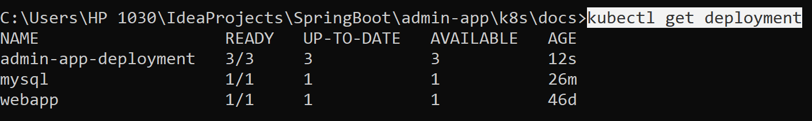

```
minikube dashboard
```
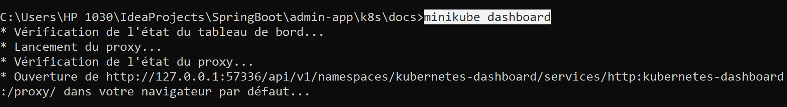

Dashboard

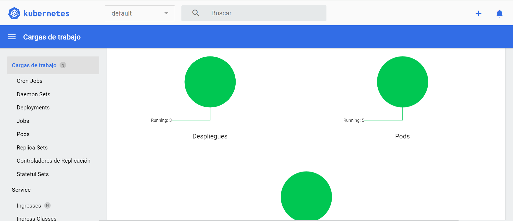

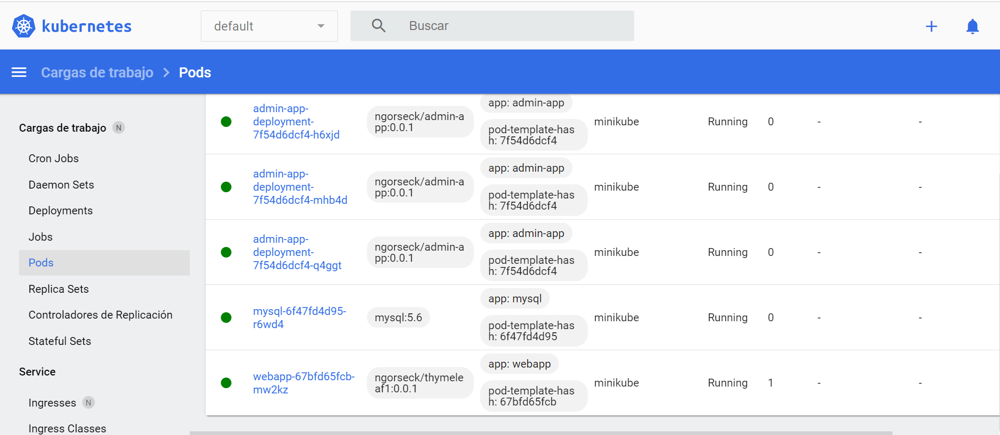

```
kubectl get svc
```
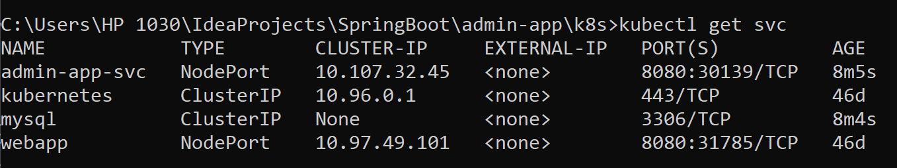

```
minikube service admin-app-svc --url
```
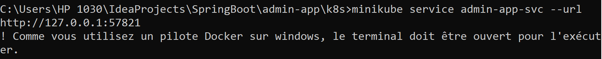

L'URL d'accès à l'application est :
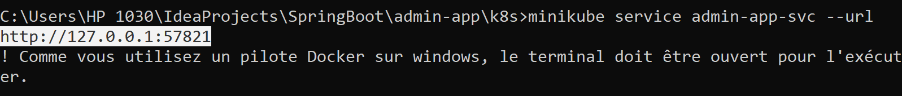

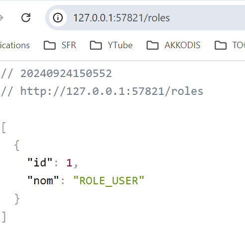

Postman
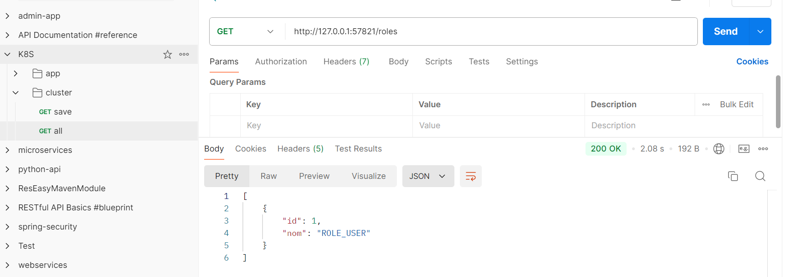

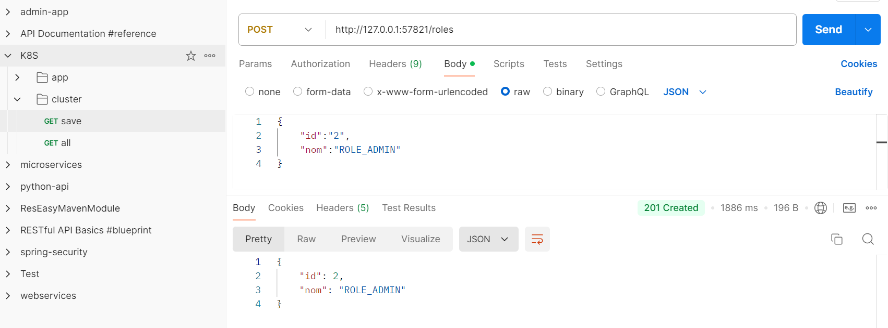

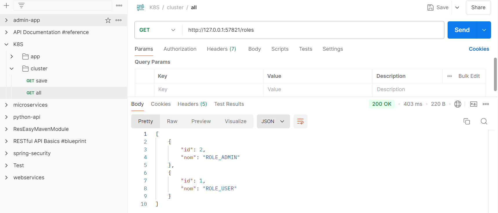


### Contact
--- 
```
Email
```
:email:  ngorsecka@gmail.com

